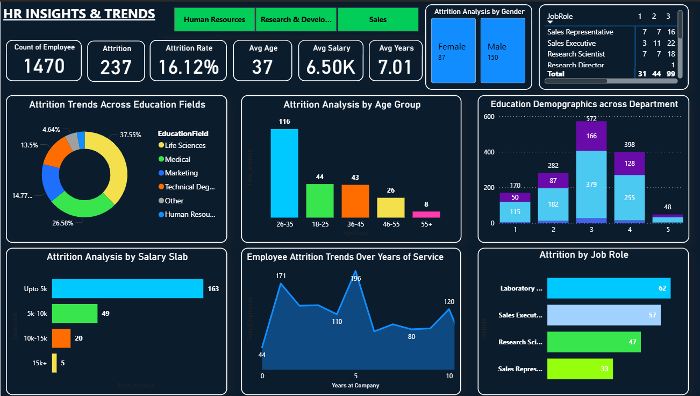

# Employee-Attrition-Dashboard

## 📌 Project Overview
This project analyzes employee attrition trends using an HR analytics dataset. The dashboard explores attrition patterns across years of service, departments, and education levels to identify high-risk employee segments and workforce stability trends.

## 🛠 Tools Used
- Power BI
- SQL
- Excel

## 📊 Key Insights
- Higher attrition observed in early tenure employees
- Sales department shows higher turnover
- R&D demonstrates stronger retention patterns

## 📁 Files Included
- Power BI dashboard (.pbix)
- HR dataset
- SQL queries
- Dashboard preview image
